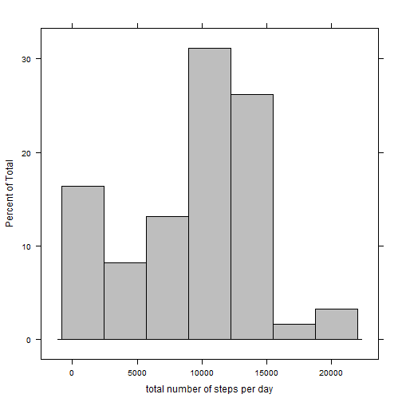
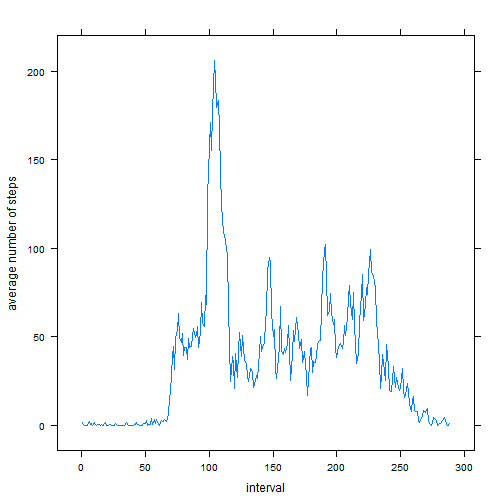
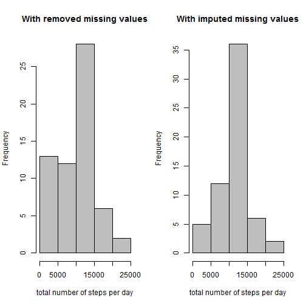

# Assignment 1


## Loading and preprocessing the data
We load the data. For now we do not apply any preprocessing; later we will
change the class of the second column by using 'as.POSIXct' function so we can cwork with dates.

```r
myData <- read.csv(file = 'activity.csv',stringsAsFactors = TRUE)
```
##What is mean total number of steps taken per day?
We calculate the total number of steps taken per day.

```r
temp <-myData[,c("steps", "date")]
totalNumTimeStepsPerDay <- as.vector(by(temp[,"steps"], temp[,"date"],
                                         FUN=sum,na.rm=TRUE))
```
We make historgram a of the total number of steps taken each day. For this we will
use 'lattice' package.

```r
library(lattice)
histogram(totalNumTimeStepsPerDay, xlab = "total number of steps per day",
          col = 'grey')
```

 

Now we calculate and report the mean and median of the total number of steps taken per day.


```r
c(mean(totalNumTimeStepsPerDay), median(totalNumTimeStepsPerDay))
```

```
## [1]  9354.23 10395.00
```

##What is the average daily activity pattern?
First we make a time series plot of the 5-minute interval (x-axis) and the average number of steps taken, averaged across all days (y-axis).

```r
numDays<-length(unique(as.character(myData[,"date"])))
numIntervals <- length(unique(myData[,"interval"]))
stepsInterval <- matrix(0,nrow=numIntervals,ncol=numDays)
for(i in 1:numDays){
    stepsInterval[,i]=as.matrix(myData[((i-1)*numIntervals+1):(i*numIntervals), c("steps")])
}
averageNumTimeStepsPerDay <-apply(stepsInterval,1,mean,na.rm=TRUE)
xyplot(averageNumTimeStepsPerDay~1:numIntervals, type='l', xlab="interval",
       ylab="average number of steps ")
```

 

We find which 5-minute interval, on average across all the days in the dataset, contains the maximum number of steps.


```r
which.max(averageNumTimeStepsPerDay)
```

```
## [1] 104
```
##Imputing missing values
First we calculate and report the total number of missing values in the dataset (i.e. the total number of rows with NAs).


```r
sum(is.na(myData[,1]))
```

```
## [1] 2304
```
For a strategy for filling in the missingvalue of a 5-minute interval in the dataset we used the mean for that interval, taken across all days. For this part of the exercise
it is useful to use POSIXct class, so we can efficiently work with 'date' column.
Using the described strategy for missing data we create a new dataset that is equal to the original dataset but with the missing data filled in with the mean for each interval.


```r
myData <- read.csv(file = 'activity.csv', as.is = TRUE)
myData[,"date"] <-as.POSIXct(myData[,"date"])
myData1 <- myData
for(i in 1:numDays){
    temp <- myData[((i-1)*numIntervals+1):(i*numIntervals), c("steps")]
    temp[is.na(temp)]<- averageNumTimeStepsPerDay[is.na(temp)]
    myData1[((i-1)*numIntervals+1):(i*numIntervals),"steps"]<-temp
}
```
Now we make a histogram of the total number of steps taken each day. For comparison
we show both histograms on one plot.


```r
temp <-myData1[,c("steps", "date")]
totalNumTimeStepsPerDay1 <- as.vector(by(temp[,"steps"], temp[,"date"],
                                         FUN=sum,na.rm=TRUE))
par(mfrow=c(1,2))
hist(totalNumTimeStepsPerDay, xlab = "total number of steps per day", 
     main="With removed missing values", col='grey')
hist(totalNumTimeStepsPerDay1, xlab = "total number of steps per day",
     main="With imputed missing values",, col='grey')
```

 

We calculate new values of the mean and median:

```r
c(mean(totalNumTimeStepsPerDay1), median(totalNumTimeStepsPerDay1))
```

```
## [1] 10766.19 10766.19
```
and compare to the old values

```r
c(mean(totalNumTimeStepsPerDay), median(totalNumTimeStepsPerDay))
```

```
## [1]  9354.23 10395.00
```

We see that replacing the NA values with the mean for each 5-minute interval changes the left tail of the distribution. The new mean and median and larger.


##Are there differences in activity patterns between weekdays and weekends?
We first create a new factor variable in the dataset with two levels - "weekday" and "weekend" indicating whether a given date is a weekday or weekend day


```r
days<-myData[,"date"]
weekendIndicator<- (weekdays(days)=="Sunday")|(weekdays(days)=="Saturday")
temp<-rep(0,length(weekendIndicator))
temp[weekendIndicator]='weekend'
temp[!weekendIndicator]='weekday'
weekendIndicator<-as.factor(temp)
```
Now we make a panel plot containing a time series plot (i.e. type = "l") of the 5-minute interval (x-axis) and the average number of steps taken, averaged across all weekday days or weekend days (y-axis).

```r
myData2<-cbind(myData1,weekendIndicator)
X <- split(myData2, weekendIndicator)

rownames(X[["weekend"]])=as.character(1:dim(X[["weekend"]])[1])
numWeekends <- dim(X[["weekend"]])[1]/length(unique(myData2[,"interval"]))
stepsIntervalWeekend <- matrix(0,nrow=numIntervals,ncol=numWeekends)
for(i in 1:numWeekends){
    stepsIntervalWeekend[,i]=as.matrix(X[["weekend"]][((i-1)*numIntervals+1):(i*numIntervals), c("steps")])
}
averageNumStepsIntervalWeekend <-apply(stepsIntervalWeekend,1,mean,na.rm=TRUE)

rownames(X[["weekday"]])=as.character(1:dim(X[["weekday"]])[1])
numWeekdays <- dim(X[["weekday"]])[1]/length(unique(myData2[,"interval"]))
stepsIntervalWeekday <- matrix(0,nrow=numIntervals,ncol=numWeekdays)
for(i in 1:numWeekdays){
    stepsIntervalWeekday[,i]=as.matrix(X[["weekday"]][((i-1)*numIntervals+1):(i*numIntervals), c("steps")])
}
averageNumStepsIntervalWeekday <-apply(stepsIntervalWeekday,1,mean,na.rm=TRUE)

x=c(averageNumStepsIntervalWeekend,averageNumStepsIntervalWeekday)
n=length(averageNumStepsIntervalWeekday)
y=rep(1:numIntervals,2)
z=factor(c(rep('weekday',n),rep('weekend',n)))#,level=c('weekday','weekend'))
xyz <-data.frame(cbind(x,y,z))
xyz[,"z"]<-factor(c(rep('weekend',n),rep('weekday',n)),level=c('weekday','weekend'))
xyplot(x~y | z, type='l', layout = c(1,2),
       xlab ='Interval', ylab='Number of steps', data=xyz)
```

 
